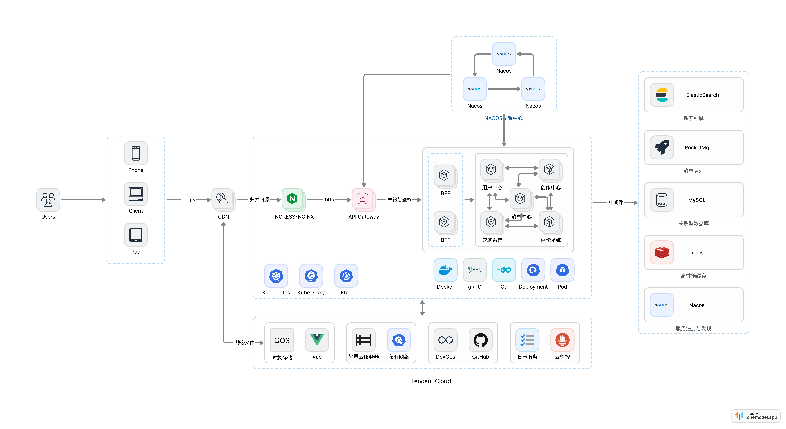

# System Architecture

## 一键构建
```
make all
```
## 启动参数
```
conf: 各模块全局配置文件，默认为conf.yaml，若使用第三方配置中心，此参数可忽略
traceUrl: 链路追踪，开发环境可忽略，生产环境必配
traceToken: 链路追踪相关token，与traceUrl一同配置
nacosUrl: 采用nacos作为配置中心，并发现和注册服务
nacosNameSpace: 使用的nacos命名空间，默认为public
nacosGroup: 使用的nacos分组，默认为DEFAULT_GROUP
nacosConfig: 若使用nacos作为配置中心，需指明具体使用哪个配置文件
nacosUserName: nacos账号
nacosPassword: nacos密码
logSelect: 日志收集器，默认输出到标准输出，也可以选择输出到Tencent的日志服务CLS
```
## 模块配置文件参数-成就系统
```
server{
    http{
        network: 配置服务端的 network 协议，如 tcp
        address: 配置服务端监听的地址， 如：0.0.0.0:8000
        timeout: 超时时间，默认1s
    }
    grpc{
        network: 配置服务端的 network 协议，如 tcp
        address: 配置服务端监听的地址， 如：0.0.0.0:9000
        timeout: 超时时间，默认1s
    }
data{
    database{
        driver: 数据库引擎，例如： mysql
        source: 相应的登录凭证，如 账号:密码@tcp(ip:端口)/库名?charset=utf8mb4&parseTime=True&loc=Local
    }
    redis{
        addr: ip:端口
        read_timeout: 读超时
        write_timeout: 写超时
        password: 密码
    }
    rocketmq{
        serverAddress: ip:端口
        nameSpace: 命名空间
        groupName: 消费组
    }
}
......
}
其他模块配置类似，不再过多阐述，想知道更多细节请查看各模块的conf.proto
```